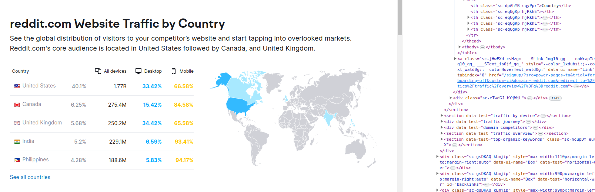

# Shkrappy

  

_Image source: https://www.reddit.com/r/Shrek/_

# Intro

En este primer proyecto completo de ETL (Extract-Transform-Load) he recogido y procesado datos de la actividad de posteo en varios foros de reddit, añadiendo información adicional que podría ser de interés para posteriores análisis. Para ello utilicé tres fuentes y dos métodos:

+ Scrapeo de los posts de los subreddits r/programming, r/memes, r/science, r/relationships, r/usa, r/canada y r/unitedkingdom vía Selenium
+ Scrapeo de una tabla de uso mayoritario de reddit por países ([semrush.com](https://www.semrush.com/website/reddit.com/overview/)) vía BeautifulSoup
+ Descarga de datos de búsqueda de noticias locales desde Google Trends, en Estados Unidos, Canadá e Inglaterra, en los últimos 7 días

El planteamiento general es obtener información interesante sobre la frecuencia de posteo en los subreddits elegidos, cuya densidad de usuarios es bastante grande (al menos 30k y en general más de 1M). Reddit [no permite un scrolling infinito] desde hace varios añoshttps://www.reddit.com/r/help/comments/1184gxn/scroll_down_limit/), por lo que he recogido todos los posibles para luego quedarme con una franja temporal común a todos.

La frecuencia de posteo podría ser útil de cara a diseñar estrategias publicitarias concretas para los distintos foros. Para complementar esta información, he buscado datos de actividad de búsqueda de Estados Unidos, Canadá e Inglaterra, desde Google Trends, tomando la búsqueda de noticias locales como referencia (para otro tipo de búsqueda las curvas eran similares). 

Una posterior comparación entre ambos sets de datos podría permitirnos tantear si los porcentajes indicados por la tabla de uso de reddit por países son plausibles, ya que la fecha y hora de los posts están expresadas en hora UTC y no nos dan información sobre el país de origen de cada uno.

El proceso está desarrollado en 5 cuadernos de jpynb:

## 1.Reddit_scrapping

La idea es sacar el mayor número de posts posibles, guardando el título, la fecha y hora de publicación y la url de la imagen si la hay. Por suerte o por desgracia (imagino que es por esto por lo que hay un límite de entradas a mostrar), aunque las de reddit sean páginas dinámicas, los posts superiores no desaparecen cuando se scrollea hacia abajo para cargar los siguientes. Por ese motivo la función creada para scrapear scrollea primero lo máximo posible y sólo extrae los datos cuando llega a este límite.

He creado dos funciones complementarias:

+ extract: recibe un post concreto y extrae la información relevante.

+ scrappy: scrollea todo lo posible el subreddit de la url indicada, guarda los posts una vez acaba y que luego llama a extract para extraer la información de todos ellos y guardarla en un dataframe.

Una vez definidas, he utilizado joblib para paralelizar el proceso y poder scrapear todos los subreddits a la vez. Una vez recogidos los datos los he guardado en formato csv. en la carpeta 'reddit' dentro de 'data'.

## 2.Semrush_scrapping

El scrapeo de la tabla de semrush fue más sencillo, ya que la información estaba en una única tabla accesible a través del html. Usando BeautifulSoup el procedimiento es directo, y una vez guardado el dataframe correspondiente lo he pasado a csv. y almacenado en 'redditusage' dentro de 'data'.

Hubiera sido interesante contar con la tabla completa de uso de reddit por países, ya que la vista previa sólo nos enseña los primeros mayoritarios. Aún así es información útil y nos servirá para sacar alguna conclusión global.

## 3.Processing_csv

Una vez recogidos los datos llegó el turno de procesarlos para preparar la subida a la base de datos y el análisis posterior. 

+ Tablas de subreddits: simplemente rellené los nulos que había en la columna de los links de imagen por 'no-image', ya que por el método de scrapeo estaban ya limpios en sí.
+ Tablas de Googe Trends: cambié las horas registradas por la hora internacional, ya que al descargar los datos te los proporciona según tu hora local y si no no podríamos comparar con las tablas de reddit.
+ Tabla de uso por países: ya le había retocado el formato tras el scrapeo, por lo que no quedaba más por hacer.

Por último, creé una función de agrupación por franja horaria para contar y normalizar el número de posts por hora a lo largo de los días, y poder medir la actividad en las tablas de reddit. Utilizando esta función, la apliqué sobre las tablas de los subreddits recortadas (quería la misma franja temporal en todas para poder comparar) y la uní a los datos de Google Trends, también recortados a la misma franja temporal. El resultado fue un dataframe que llamé 'activity' y que también subí más tarde a la base de datos.

## 4.Mongo_loading

Para subir los datos a Mongo, importé los csv y los transformé en diccionarios. Una vez hecho eso, creé la database desde jupyter notebook utilizando la librería pymongo, y la llené.

## 5.Data_analysis

Por último, he realizado un análisis preliminar de los datos y sacado algunas conclusiones. Comparando los reddits nacionales (r/usa, r/canada y r/uk) con sus homólogos en Google Trends, vemos que las curvas de actividad cuadran bastante bien como cabría esperar si los usuarios corresponden a dichas nacionalidades. 

Debajo se muestra el caso estadounidense, en que ambas curvas muestran un partón de actividad similar salvando que la actividad durante el sábado 05 de agosto se dispara en la curva de reddit (en azul) y disminuye en la búsqueda de noticias (naranja).

Por otro lado, las curvas de los subreddits temáticos no encajan con los patrones de actividad de ninguno de los países, lo que encaja con una población de usuarios de nacionalidades más diversas. El subreddit de relaciones, que es el más activo, también aumenta su actividad el sábado, lo que cuadra con un foro de tipo consulta/expresión personal.

Por último, he estudiado las horas clave de actividad en los foros nacionales y generales, resumiendo la información de los picos y valles en distintas tablas. Abajo muestro la correspondiente a r/usa, r/canada y r/uk en hora local, lo que podría ser útil de cara a futuros análisis.

# Futuros pasos

Sería interesante hacer un estudio del contenido de los posts, analizando los títulos y las imágenes de los mismos. Un estudio de este tipo ayudaría a conectar con los usuarios de manera más personalizada. 

Como fun fact, por algún motivo hasta la fecha desconocido, el 90% del contenido del subreddit de r/memes son memes de Shrek...

  

